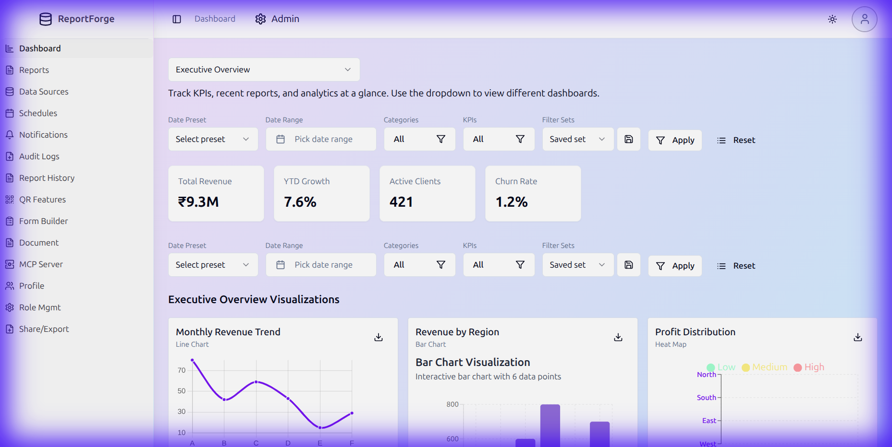
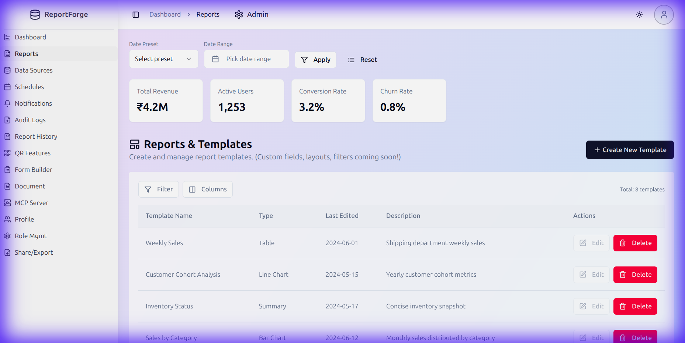
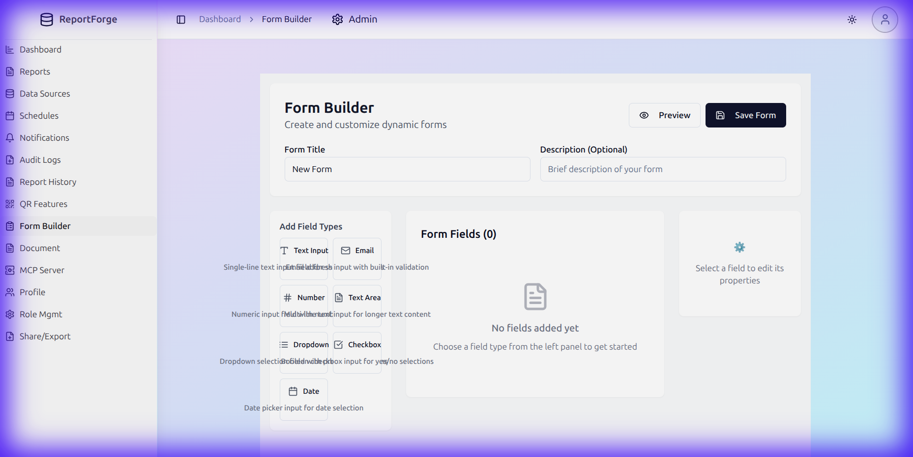
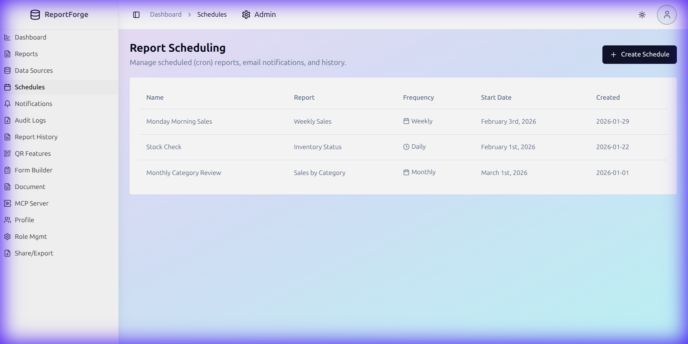

# ReportForge


A comprehensive, enterprise-grade **Report Dashboard Application** built with modern web technologies. This platform provides powerful data visualization, report generation, form building, and administrative capabilities—all wrapped in a beautiful, responsive UI.



---

## ✨ Features at a Glance

| Feature | Description |
|---------|-------------|
| 📊 **Multi-Dashboard System** | Switch between different dashboards (Executive Overview, Retail Performance) |
| 📈 **20+ Chart Types** | Line, Bar, Pie, Heatmaps, Sankey, Candlestick, Violin, and more |
| 📝 **Report Generator** | Create summary, trend, and custom SQL reports |
| 🏗️ **Form Builder** | Visual drag-and-drop form creation tool |
| 📅 **Report Scheduling** | Automate reports (daily, weekly, monthly) |
| 👥 **Role Management** | Assign dashboards and permissions to roles |
| 🔍 **Audit Trail** | Track all user actions for compliance |
| 🌙 **Dark/Light Mode** | Beautiful theming with smooth transitions |
| 📱 **Responsive Design** | Works seamlessly on desktop, tablet, and mobile |

---

## 🖼️ Screenshots

### Dashboard Home
The main dashboard with customizable KPIs, interactive charts, and advanced filtering.


### Reports Management
Create, manage, and configure report templates with CRUD operations.



### Form Builder
Visual form creation with drag-and-drop fields, validation rules, and live preview.



### Report Scheduling
Automate report generation with flexible scheduling options.



---

## 🏗️ Tech Stack

| Layer | Technology |
|-------|------------|
| **Framework** | React 18 + TypeScript |
| **Build Tool** | Vite 5.x |
| **Routing** | React Router DOM 6.x |
| **State Management** | React Context API + TanStack Query |
| **Styling** | Tailwind CSS 3.x + shadcn/ui (Radix primitives) |
| **Visualization** | Recharts, Chart.js, D3.js |
| **Utilities** | date-fns, zod, xlsx, html2canvas |

---

## 📊 Key Features Deep Dive

### 1. Dashboard System
- **Multi-dashboard support**: Users can switch between dashboards (e.g., "Executive Overview", "Retail Performance")
- **Customizable KPIs**: Drag-and-drop reordering with localStorage persistence
- **Advanced Filtering**: Category filters, KPI filters, date ranges, and savable filter presets
- **Drilldown Modals**: Click on KPIs to see detailed breakdowns
- **Audit Trail**: Tracks user actions like "Viewed KPI Details", stored in localStorage

### 2. Visualization Engine (20+ Chart Types)
The project supports an impressive variety of charts:

| Category | Charts |
|----------|--------|
| **Basic** | Line, Bar, Pie, Donut, Area, Scatter |
| **Advanced** | Heat Map, Treemap, Bubble, Stacked Bar, Combo |
| **Financial** | Candlestick Charts |
| **Statistical** | Violin Charts |
| **Flow** | Sankey Diagrams |
| **Temporal** | Calendar Heat Maps |
| **Geographic** | D3 India Map Chart |

Each chart supports **export to PNG/JPEG/SVG** via `ChartExportMenu`.

### 3. Report Generator
A comprehensive reporting engine with:
- **Report Types**: Simple Summary, Top 10 Records, Aggregated Reports, Custom SQL, Trend Analysis, Performance Metrics
- **Data Sources**: Connect to Users, Orders, Products, Analytics
- **Output Formats**: Configurable formatting and export options
- **Scheduling**: Daily, weekly, or monthly automation with email recipients

### 4. Form Builder
A modular, visual form creation system:
- **Field Types**: Text, Email, Number, Date, Select, Checkbox, Radio, Textarea, File Upload
- **Features**: Required/optional fields, validation rules, drag-and-drop reordering
- **Preview Mode**: Real-time form preview
- **Dynamic Forms**: Forms can be rendered by ID via `/form/:formId`

### 5. Administration
- **Role Management**: Create/edit roles, assign permissions
- **User Management**: Demo user creation with localStorage
- **Dashboard Assignment**: Assign dashboards to specific roles
- **Audit Logs**: Track all user actions

### 6. Data Management
- **Data Sources Page**: Configure databases, APIs, file uploads
- **Merge/Delete Records**: Bulk operations
- **Document Table**: Manage uploaded documents

### 7. Utilities
- **QR Features**: QR code generation and scanning
- **Theme System**: Light/dark mode with `next-themes` integration
- **Notifications**: Toast notifications via Sonner + shadcn Toaster
- **Export**: Excel export via `xlsx`, canvas capture via `html2canvas`

---

## 📁 Project Structure

```
src/
├── pages/              # 21 page components (routes)
│   ├── DashboardHome.tsx     # Main dashboard with KPIs & charts
│   ├── ReportsPage.tsx       # Report template management
│   ├── SchedulesPage.tsx     # Report scheduling
│   ├── FormBuilderPage.tsx   # Visual form builder
│   ├── RoleMgmtPage.tsx      # Role/permission management
│   └── ...
├── components/         # 122+ reusable components
│   ├── charts/         # 20 chart implementations
│   ├── form-builder/   # Form builder sub-components
│   ├── ui/             # 49 shadcn/ui primitives
│   └── ...
├── contexts/           # DashboardContext for global state
├── layouts/            # DashboardLayout (sidebar + header)
├── hooks/              # useToast, etc.
└── lib/                # Utilities (cn, etc.)
```

---

## 🚀 Getting Started

### Prerequisites
- Node.js 18+ installed ([install with nvm](https://github.com/nvm-sh/nvm#installing-and-updating))
- npm or yarn

### Installation

```bash
# Clone the repository
git clone <YOUR_GIT_URL>

# Navigate to the project directory
cd report-dash-ui

# Install dependencies
npm install

# Start the development server
npm run dev
```

The application will be available at `http://localhost:8080` (or another port if 8080 is in use).

### Build for Production

```bash
npm run build
npm run preview
```

---

## 🔧 Available Scripts

| Script | Description |
|--------|-------------|
| `npm run dev` | Start development server with HMR |
| `npm run build` | Build for production |
| `npm run build:dev` | Build in development mode |
| `npm run preview` | Preview production build |
| `npm run lint` | Run ESLint |

---

## 🔍 Code Quality

### Strengths
- ✅ Well-documented code with JSDoc comments
- ✅ Modular architecture (Form Builder split into sub-components)
- ✅ Type-safe with TypeScript interfaces
- ✅ Consistent use of shadcn/ui patterns
- ✅ localStorage used for demo persistence (KPI order, users, audits)

### Areas for Enhancement
- ⚠️ No backend integration – Currently uses mock data and localStorage
- ⚠️ MCP Server Page is a placeholder for future API integrations
- ⚠️ Authentication is UI-only (SignIn/SignUp pages exist but no real auth)
- ⚠️ Some pages like FeedbackPage, SharePage, NotificationsPage are minimal stubs

---

## 🎯 Roadmap

- [ ] **Backend Integration**: Connect to a real API (REST or GraphQL)
- [ ] **Authentication**: Implement real auth (e.g., Supabase, Auth0, Firebase)
- [ ] **State Management**: Consider Zustand or Redux for complex state
- [ ] **Testing**: Add unit tests (Vitest) and E2E tests (Playwright)
- [ ] **MCP Integration**: Build out the MCP Server APIs for dashboard/report endpoints
- [ ] **Real-time Updates**: WebSocket integration for live data

---

## 🤝 Contributing

1. Fork the repository
2. Create your feature branch (`git checkout -b feature/amazing-feature`)
3. Commit your changes (`git commit -m 'Add some amazing feature'`)
4. Push to the branch (`git push origin feature/amazing-feature`)
5. Open a Pull Request


## 🙏 Acknowledgments

- [shadcn/ui](https://ui.shadcn.com/) - Beautiful UI components
- [Recharts](https://recharts.org/) - Charting library
- [D3.js](https://d3js.org/) - Data visualization
- [Tailwind CSS](https://tailwindcss.com/) - Utility-first CSS framework
- [Vite](https://vitejs.dev/) - Fast build tool
