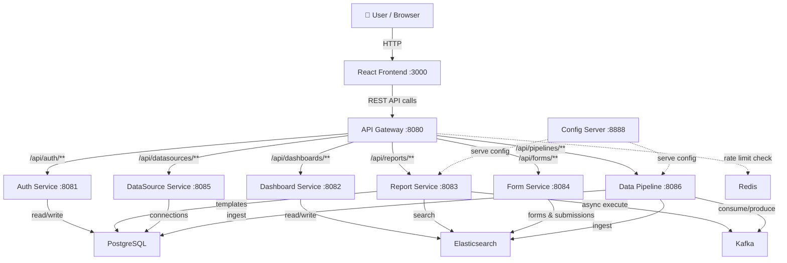
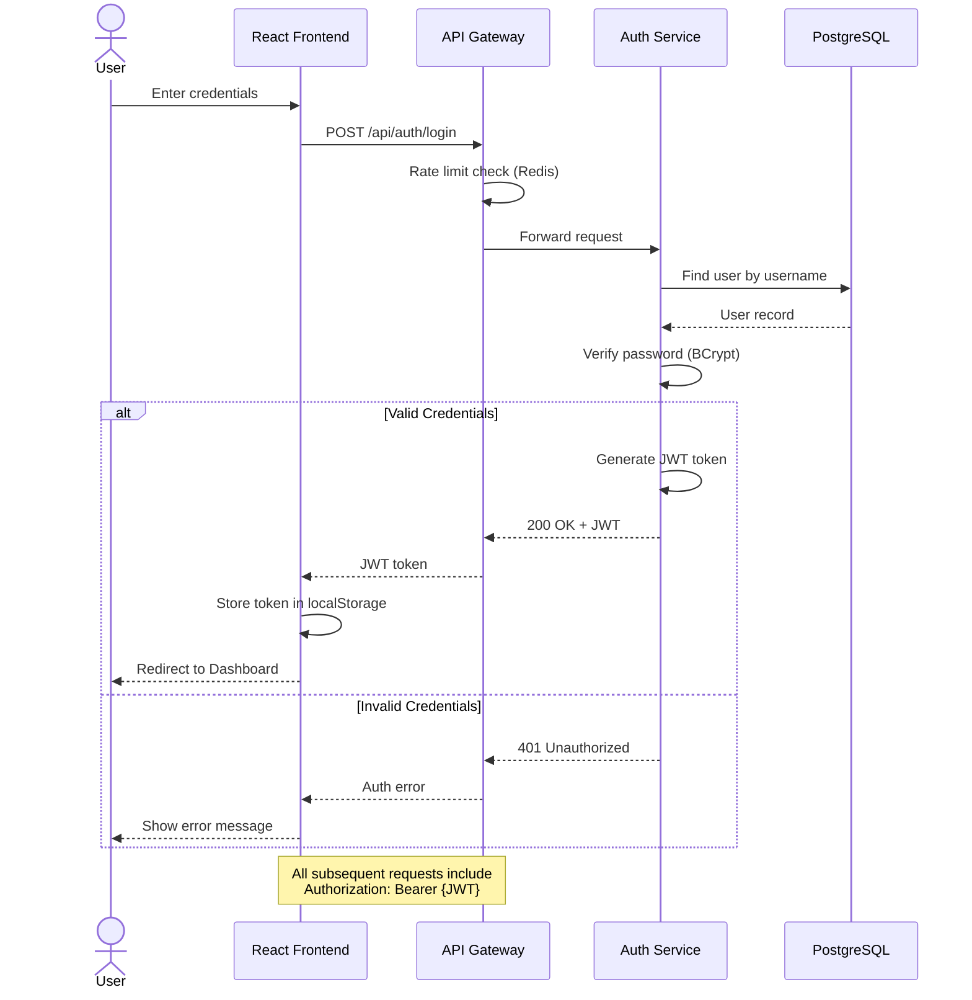
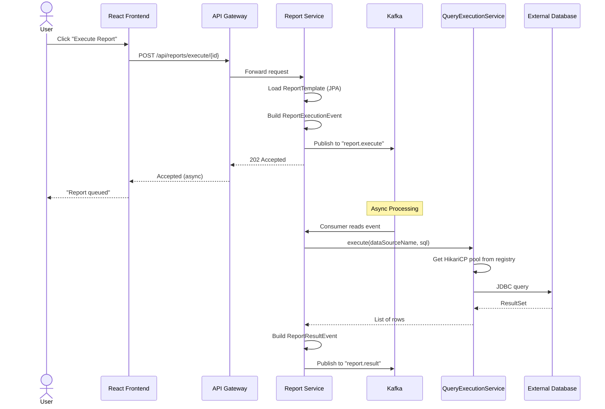
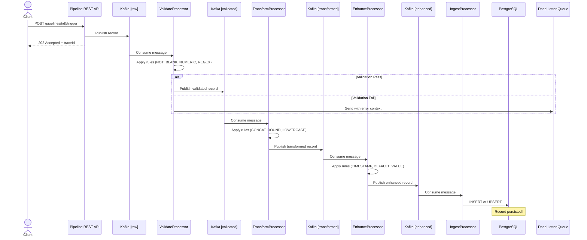
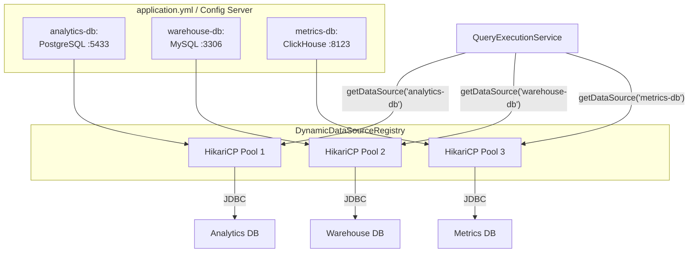
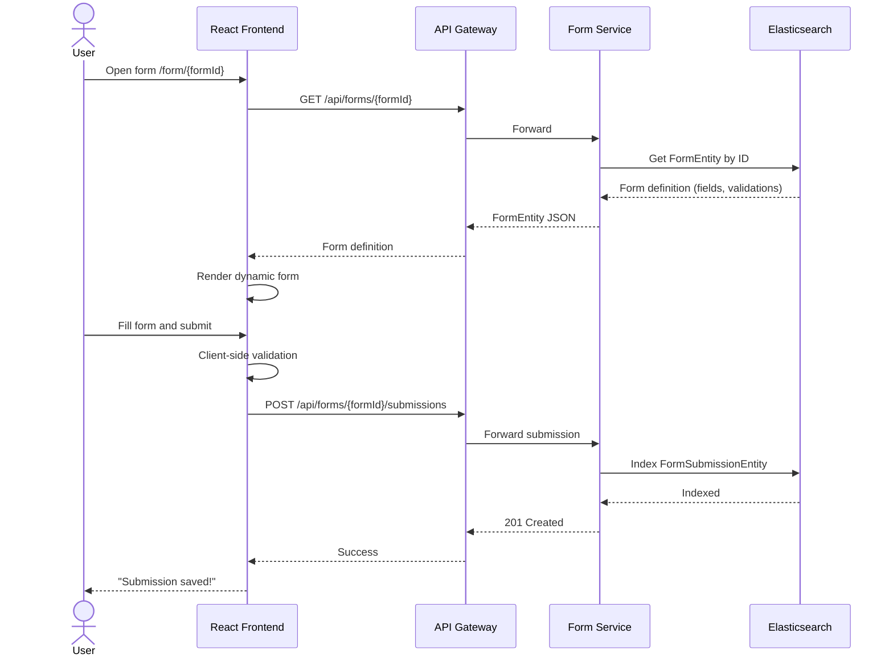
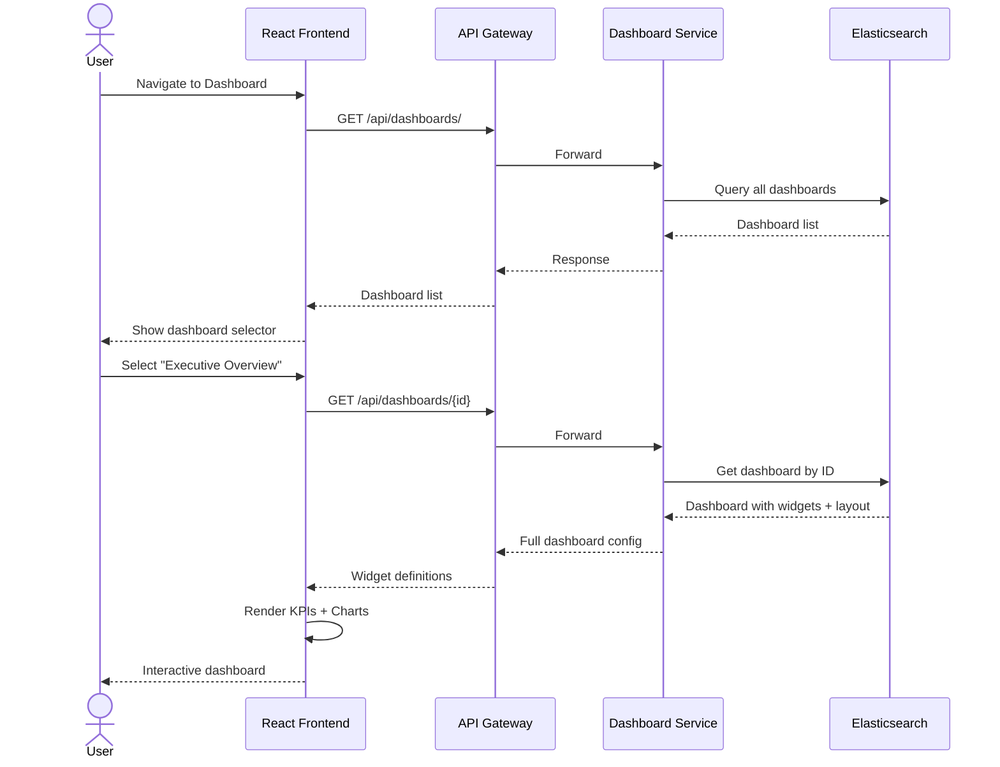
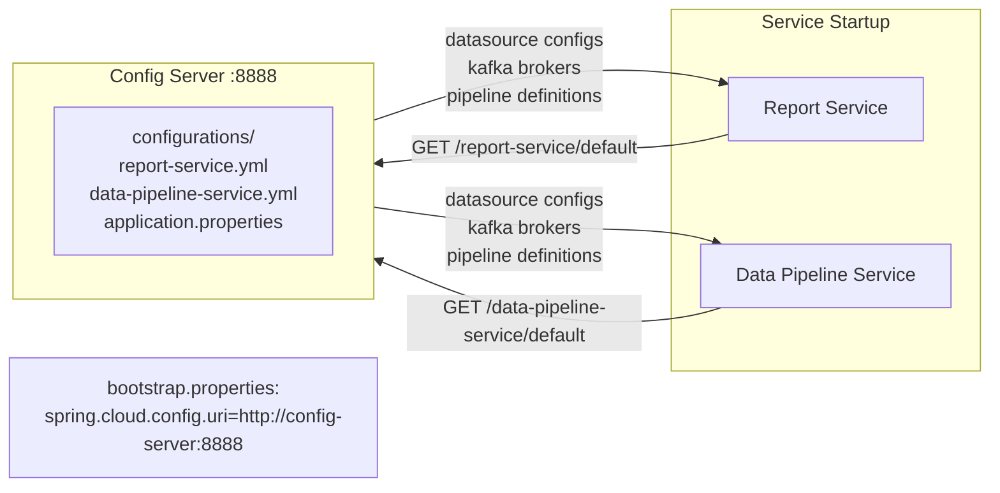

# 🛠️ ReportForge


A comprehensive, enterprise-grade **Report Dashboard Platform** — a full-stack application with a React frontend, Spring Boot microservices, Kafka data pipelines, and one-command Docker deployment.

---

## 🏛️ Architecture

```
┌────────────────────────────────────────────────────────────────────┐
│                        React Frontend (:3000)                      │
└──────────────────────────────┬─────────────────────────────────────┘
                               │
                    ┌──────────▼──────────┐
                    │   API Gateway :8080  │ ── Redis (rate limiting)
                    └──────────┬──────────┘
         ┌─────────┬──────────┼──────────┬──────────┬──────────┐
         ▼         ▼          ▼          ▼          ▼          ▼
    Auth :8081  Dash :8082 Report :8083 Form :8084 DS :8085  Pipeline :8086
     (JWT)      (ES)     (PG+ES+Kafka)  (ES)      (PG)     (Kafka+PG+ES)
         │         │          │          │          │          │
    ┌────▼─────────▼──────────▼──────────▼──────────▼──────────▼────┐
    │   PostgreSQL :5432  │  Elasticsearch :9200  │  Kafka :9092    │
    └─────────────────────┴───────────────────────┴────────────────-┘
                               │
                    ┌──────────▼──────────┐
                    │  Config Server :8888 │
                    └─────────────────────┘
```

---

## 📦 Service Map

| Service | Port | Database | Description |
|---------|------|----------|-------------|
| **API Gateway** | 8080 | Redis | Spring Cloud Gateway — routing, CORS, rate limiting |
| **Auth Service** | 8081 | PostgreSQL | JWT authentication, registration, RBAC |
| **Dashboard Service** | 8082 | Elasticsearch | Dashboard CRUD with widgets & layouts |
| **Report Service** | 8083 | PostgreSQL + ES + Kafka | Templates, multi-DB execution, scheduling |
| **Form Service** | 8084 | Elasticsearch | Dynamic form definitions & submissions |
| **DataSource Service** | 8085 | PostgreSQL | Database connection management |
| **Data Pipeline** | 8086 | Kafka + PG + ES | Generic, config-driven ETL pipeline |
| **Config Server** | 8888 | — | Centralized config for all services |

---

## 🔀 Flow Diagrams

### 1. System Overview — Request Flow


```mermaid
graph TB
    User["👤 User / Browser"] -->|HTTP| FE["React Frontend :3000"]
    FE -->|REST API calls| GW["API Gateway :8080"]
    GW -->|"/api/auth/**"| AS["Auth Service :8081"]
    GW -->|"/api/dashboards/**"| DS["Dashboard Service :8082"]
    GW -->|"/api/reports/**"| RS["Report Service :8083"]
    GW -->|"/api/forms/**"| FS["Form Service :8084"]
    GW -->|"/api/datasources/**"| DSS["DataSource Service :8085"]
    GW -->|"/api/pipelines/**"| DP["Data Pipeline :8086"]

    GW -.->|rate limit check| Redis["Redis"]
    AS -->|read/write| PG["PostgreSQL"]
    DS -->|read/write| ES["Elasticsearch"]
    RS -->|templates| PG
    RS -->|search| ES
    RS -->|async execute| Kafka["Kafka"]
    FS -->|forms & submissions| ES
    DSS -->|connections| PG
    DP -->|consume/produce| Kafka
    DP -->|ingest| PG
    DP -->|ingest| ES

    CS["Config Server :8888"] -.->|serve config| RS
    CS -.->|serve config| DP
```

### 2. Authentication Flow


```mermaid
sequenceDiagram
    actor User
    participant FE as React Frontend
    participant GW as API Gateway
    participant Auth as Auth Service
    participant DB as PostgreSQL

    User->>FE: Enter credentials
    FE->>GW: POST /api/auth/login
    GW->>GW: Rate limit check (Redis)
    GW->>Auth: Forward request
    Auth->>DB: Find user by username
    DB-->>Auth: User record
    Auth->>Auth: Verify password (BCrypt)
    alt Valid Credentials
        Auth->>Auth: Generate JWT token
        Auth-->>GW: 200 OK + JWT
        GW-->>FE: JWT token
        FE->>FE: Store token in localStorage
        FE-->>User: Redirect to Dashboard
    else Invalid Credentials
        Auth-->>GW: 401 Unauthorized
        GW-->>FE: Auth error
        FE-->>User: Show error message
    end

    Note over FE,GW: All subsequent requests include<br/>Authorization: Bearer {JWT}
```

### 3. Report Execution Flow (Async via Kafka)


```mermaid
sequenceDiagram
    actor User
    participant FE as React Frontend
    participant GW as API Gateway
    participant RS as Report Service
    participant Kafka as Kafka
    participant QE as QueryExecutionService
    participant ExtDB as External Database

    User->>FE: Click "Execute Report"
    FE->>GW: POST /api/reports/execute/{id}
    GW->>RS: Forward request
    RS->>RS: Load ReportTemplate (JPA)
    RS->>RS: Build ReportExecutionEvent
    RS->>Kafka: Publish to "report.execute"
    RS-->>GW: 202 Accepted
    GW-->>FE: Accepted (async)
    FE-->>User: "Report queued"

    Note over Kafka: Async Processing

    Kafka->>RS: Consumer reads event
    RS->>QE: execute(dataSourceName, sql)
    QE->>QE: Get HikariCP pool from registry
    QE->>ExtDB: JDBC query
    ExtDB-->>QE: ResultSet
    QE-->>RS: List of rows
    RS->>RS: Build ReportResultEvent
    RS->>Kafka: Publish to "report.result"
```

### 4. Data Pipeline Flow (Validate → Transform → Enhance → Ingest)


```mermaid
sequenceDiagram
    actor Client
    participant API as Pipeline REST API
    participant K1 as Kafka [raw]
    participant VP as ValidateProcessor
    participant K2 as Kafka [validated]
    participant TP as TransformProcessor
    participant K3 as Kafka [transformed]
    participant EP as EnhanceProcessor
    participant K4 as Kafka [enhanced]
    participant IP as IngestProcessor
    participant DB as PostgreSQL
    participant DLQ as Dead Letter Queue

    Client->>API: POST /pipelines/{id}/trigger
    API->>K1: Publish record
    API-->>Client: 202 Accepted + traceId

    K1->>VP: Consume message
    VP->>VP: Apply rules (NOT_BLANK, NUMERIC, REGEX)
    alt Validation Pass
        VP->>K2: Publish validated record
    else Validation Fail
        VP->>DLQ: Send with error context
    end

    K2->>TP: Consume message
    TP->>TP: Apply rules (CONCAT, ROUND, LOWERCASE)
    TP->>K3: Publish transformed record

    K3->>EP: Consume message
    EP->>EP: Apply rules (TIMESTAMP, DEFAULT_VALUE)
    EP->>K4: Publish enhanced record

    K4->>IP: Consume message
    IP->>DB: INSERT or UPSERT
    Note over DB: Record persisted!
```

### 5. Multi-Database Query Execution


```mermaid
graph TB
    subgraph Config["application.yml / Config Server"]
        C1["analytics-db:<br/>PostgreSQL :5433"]
        C2["warehouse-db:<br/>MySQL :3306"]
        C3["metrics-db:<br/>ClickHouse :8123"]
    end

    subgraph Registry["DynamicDataSourceRegistry"]
        P1["HikariCP Pool 1"]
        P2["HikariCP Pool 2"]
        P3["HikariCP Pool 3"]
    end

    C1 --> P1
    C2 --> P2
    C3 --> P3

    QES["QueryExecutionService"] -->|"getDataSource('analytics-db')"| P1
    QES -->|"getDataSource('warehouse-db')"| P2
    QES -->|"getDataSource('metrics-db')"| P3

    P1 -->|JDBC| DB1["Analytics DB"]
    P2 -->|JDBC| DB2["Warehouse DB"]
    P3 -->|JDBC| DB3["Metrics DB"]
```

### 6. Form Submission Flow


```mermaid
sequenceDiagram
    actor User
    participant FE as React Frontend
    participant GW as API Gateway
    participant FS as Form Service
    participant ES as Elasticsearch

    User->>FE: Open form /form/{formId}
    FE->>GW: GET /api/forms/{formId}
    GW->>FS: Forward
    FS->>ES: Get FormEntity by ID
    ES-->>FS: Form definition (fields, validations)
    FS-->>GW: FormEntity JSON
    GW-->>FE: Form definition
    FE->>FE: Render dynamic form

    User->>FE: Fill form and submit
    FE->>FE: Client-side validation
    FE->>GW: POST /api/forms/{formId}/submissions
    GW->>FS: Forward submission
    FS->>ES: Index FormSubmissionEntity
    ES-->>FS: Indexed
    FS-->>GW: 201 Created
    GW-->>FE: Success
    FE-->>User: "Submission saved!"
```

### 7. Dashboard Rendering Flow


```mermaid
sequenceDiagram
    actor User
    participant FE as React Frontend
    participant GW as API Gateway
    participant DS as Dashboard Service
    participant ES as Elasticsearch

    User->>FE: Navigate to Dashboard
    FE->>GW: GET /api/dashboards/
    GW->>DS: Forward
    DS->>ES: Query all dashboards
    ES-->>DS: Dashboard list
    DS-->>GW: Response
    GW-->>FE: Dashboard list
    FE-->>User: Show dashboard selector

    User->>FE: Select "Executive Overview"
    FE->>GW: GET /api/dashboards/{id}
    GW->>DS: Forward
    DS->>ES: Get dashboard by ID
    ES-->>DS: Dashboard with widgets + layout
    DS-->>GW: Full dashboard config
    GW-->>FE: Widget definitions
    FE->>FE: Render KPIs + Charts
    FE-->>User: Interactive dashboard
```

### 8. Config Server Flow


```mermaid
graph LR
    subgraph ConfigServer["Config Server :8888"]
        CF["configurations/<br/>report-service.yml<br/>data-pipeline-service.yml<br/>application.properties"]
    end

    subgraph StartupSequence["Service Startup"]
        RS["Report Service"]
        DP["Data Pipeline Service"]
    end

    RS -->|"GET /report-service/default"| ConfigServer
    DP -->|"GET /data-pipeline-service/default"| ConfigServer
    ConfigServer -->|datasource configs<br/>kafka brokers<br/>pipeline definitions| RS
    ConfigServer -->|datasource configs<br/>kafka brokers<br/>pipeline definitions| DP

    Note["bootstrap.properties:<br/>spring.cloud.config.uri=http://config-server:8888"]
```

---

## 🎯 Use Cases

### UC1: Business Analyst — Generate Report

| Item | Detail |
|------|--------|
| **Actor** | Business Analyst |
| **Goal** | Execute a report against an external database |
| **Precondition** | User is authenticated, report template exists |
| **Flow** | 1. Navigate to Reports page 2. Select a report template 3. Click "Execute" 4. System publishes to Kafka → Consumer queries external DB → Results published to Kafka 5. Results stored/available |
| **Alternate** | Template not found → 404 error; DB connection fails → result event with FAILED status |

### UC2: Admin — Add a New Database

| Item | Detail |
|------|--------|
| **Actor** | System Admin |
| **Goal** | Connect a new external database for reports |
| **Precondition** | Database is reachable from the service |
| **Flow** | 1. Add entry in `application.yml` or Config Server 2. Define url, username, password, driver-class-name, max-pool-size 3. Restart service (or refresh if using Config Server + actuator) 4. New datasource is automatically registered in DynamicDataSourceRegistry 5. Ready for queries — zero code changes |

### UC3: Data Engineer — Create a New Pipeline

| Item | Detail |
|------|--------|
| **Actor** | Data Engineer |
| **Goal** | Set up an ETL pipeline for a new data source |
| **Precondition** | Kafka and target DB are running |
| **Flow** | 1. Add pipeline definition in `application.yml` 2. Define phases: validate (rules), transform (rules), enhance (rules), ingest (target) 3. Restart data-pipeline-service 4. Service auto-creates Kafka topics and registers listeners 5. Pipeline ready — trigger via `POST /api/v1/pipelines/{id}/trigger` |

### UC4: Form Creator — Build and Publish a Form

| Item | Detail |
|------|--------|
| **Actor** | Form Creator |
| **Goal** | Create a dynamic form and collect responses |
| **Flow** | 1. Open Form Builder page 2. Drag-and-drop fields (text, email, select, etc.) 3. Set validation rules (required, min/max, regex) 4. Preview the form 5. Publish → form definition stored in Elasticsearch 6. Share form URL → respondents submit → submissions indexed in ES |

### UC5: Dashboard User — View KPIs and Charts

| Item | Detail |
|------|--------|
| **Actor** | Dashboard User |
| **Goal** | View business metrics on a dashboard |
| **Flow** | 1. Login (JWT) 2. Select a dashboard (e.g., "Executive Overview") 3. System fetches dashboard config from Elasticsearch 4. KPIs and charts rendered 5. Apply filters (date range, categories) 6. Click KPI for drilldown modal 7. Export chart as PNG/SVG |

### UC6: Operations — Monitor Pipeline Failures

| Item | Detail |
|------|--------|
| **Actor** | Operations / DevOps |
| **Goal** | Identify and debug failed pipeline records |
| **Flow** | 1. Record enters pipeline via Kafka topic 2. Fails validation (e.g., blank email) 3. DeadLetterHandler sends to `pipeline.dlq` with error context 4. DLQ message includes: error message, pipeline ID, phase name, trace ID, original data 5. Operations team consumes DLQ or monitors via Kafka tooling 6. Fix source data and re-trigger |

---

## ✨ Features

### Frontend (React + TypeScript)

| Feature | Description |
|---------|-------------|
| 📊 Multi-Dashboard System | Switch between dashboards with customizable KPIs |
| 📈 20+ Chart Types | Line, Bar, Pie, Heatmap, Sankey, Candlestick, Violin, and more |
| 📝 Report Generator | Summary, trend, custom SQL reports with scheduling |
| 🏗️ Form Builder | Drag-and-drop visual form creation |
| 👥 Role Management | Assign dashboards and permissions to roles |
| 🔍 Audit Trail | Track all user actions for compliance |
| 🤖 AI Assistant | Floating chatbot widget |
| ⌨️ Command Palette | Global Cmd+K quick actions |
| 🌙 Dark/Light Mode | Smooth theme transitions |
| 📱 Responsive | Desktop, tablet, and mobile |

### Backend (Spring Boot Microservices)

| Feature | Description |
|---------|-------------|
| 🔐 JWT Auth | Secure authentication with role-based access |
| 🗄️ Multi-Database Reports | Connect to any database via YAML config — no code changes |
| 📨 Kafka Data Pipeline | Async report execution via producer/consumer pattern |
| ⚙️ Config Server | Centralized config management for all services |
| 🚪 API Gateway | Single entry point with rate limiting & CORS |
| 🔄 Generic ETL Pipeline | Configurable validate → transform → enhance → ingest phases |

---

## 🔄 Data Pipeline Service

A standalone, **reusable** data processing engine with configurable phases. Add new pipelines with **zero code changes**.

### How It Works

```
POST /trigger → Kafka[raw] → Validate → Kafka[validated] → Transform → Kafka[transformed]
                → Enhance → Kafka[enhanced] → Ingest → PostgreSQL/Elasticsearch
                     ↓ (on failure at any phase)
                Dead Letter Queue (pipeline.dlq)
```

### Adding a Pipeline (config only)

```yaml
pipeline:
  definitions:
    my-pipeline:
      phases:
        - name: validate
          topic-in: pipeline.my.raw
          topic-out: pipeline.my.validated
          rules:
            - { field: email, type: NOT_BLANK }
            - { field: amount, type: NUMERIC, min: 0 }
        - name: transform
          topic-in: pipeline.my.validated
          topic-out: pipeline.my.transformed
          rules:
            - { field: email, type: LOWERCASE }
            - { field: full_name, type: CONCAT, sources: [first_name, last_name], separator: " " }
        - name: ingest
          topic-in: pipeline.my.transformed
          target: { type: POSTGRESQL, table: my_table, mode: UPSERT, key-fields: [id] }
```

### Supported Rules

| Phase | Rules |
|-------|-------|
| **Validate** | `REQUIRED`, `NOT_BLANK`, `NUMERIC` (min/max), `REGEX` |
| **Transform** | `CONCAT`, `ROUND`, `LOWERCASE`, `UPPERCASE`, `TRIM`, `RENAME`, `DATE_FORMAT` |
| **Enhance** | `TIMESTAMP`, `DEFAULT_VALUE`, `LOOKUP`, `COPY`, `COMPUTED` |
| **Ingest** | `POSTGRESQL` (INSERT/UPSERT), `ELASTICSEARCH`, `LOG`, `FILE` |

---

## 🛠️ Tech Stack

| Layer | Technology |
|-------|------------|
| **Frontend** | React 18, TypeScript, Vite, Tailwind CSS, shadcn/ui, Recharts, D3.js |
| **Backend** | Spring Boot 2.7, Spring Cloud Gateway, Spring Data JPA/Elasticsearch |
| **Messaging** | Apache Kafka (Confluent 7.4) |
| **Databases** | PostgreSQL 15, Elasticsearch 8.10 |
| **Caching** | Redis 7 |
| **Config** | Spring Cloud Config Server (native profile) |
| **API Design** | OpenAPI 3.0 + OpenAPI Generator (code-first) |
| **Containerization** | Docker, Docker Compose |

---

## 🚀 Getting Started

### Prerequisites

- Docker & Docker Compose
- Java 8+ (for local development)
- Node.js 18+ (for frontend development)

### One-Command Startup

```bash
git clone https://github.com/samargupta096/report-forge.git
cd report-forge
docker-compose up --build
```

| URL | Service |
|-----|---------|
| http://localhost:3000 | Frontend |
| http://localhost:8080/api/auth/** | Auth (via Gateway) |
| http://localhost:8080/api/dashboards/** | Dashboards (via Gateway) |
| http://localhost:8080/api/reports/** | Reports (via Gateway) |
| http://localhost:8080/api/forms/** | Forms (via Gateway) |
| http://localhost:8080/api/datasources/** | DataSources (via Gateway) |
| http://localhost:8080/api/pipelines/** | Data Pipeline (via Gateway) |
| http://localhost:8888 | Config Server |

### Local Frontend Development

```bash
npm install
npm run dev
```

### Local Backend Development

```bash
# Start infrastructure (PostgreSQL, Elasticsearch, Kafka, Redis)
docker-compose up postgres elasticsearch redis zookeeper kafka

# Run any service
cd backend/report-service
mvn spring-boot:run
```

---

## 📁 Project Structure

```
report-forge/
├── src/                          # React Frontend
│   ├── pages/                    # 21 page components
│   ├── components/               # 122+ reusable components
│   │   ├── charts/               # 20 chart implementations
│   │   ├── form-builder/         # Form builder sub-components
│   │   └── ui/                   # 49 shadcn/ui primitives
│   ├── contexts/                 # React Context providers
│   └── layouts/                  # Dashboard layout
│
├── backend/
│   ├── api-gateway/              # Spring Cloud Gateway (port 8080)
│   ├── auth-service/             # JWT Auth + PostgreSQL (port 8081)
│   ├── dashboard-service/        # Elasticsearch CRUD (port 8082)
│   ├── report-service/           # Multi-DB reports + Kafka (port 8083)
│   │   ├── config/               #   ReportDataSourceProperties, KafkaTopicConfig
│   │   ├── service/              #   QueryExecutionService, ReportEventProducer/Consumer
│   │   └── entity/               #   ReportTemplateEntity, ReportScheduleEntity
│   ├── form-service/             # Elasticsearch forms (port 8084)
│   ├── data-source-service/      # PostgreSQL connections (port 8085)
│   ├── data-pipeline-service/    # Generic ETL pipeline (port 8086)
│   │   ├── config/               #   PipelineProperties, RuleDefinition, TopicInitializer
│   │   ├── processor/            #   Validate/Transform/Enhance/Ingest processors
│   │   ├── orchestrator/         #   PipelineOrchestrator, DeadLetterHandler
│   │   └── controller/           #   PipelineController (REST API)
│   └── config-server/            # Spring Cloud Config (port 8888)
│
├── docker-compose.yml            # Full stack orchestration
├── Dockerfile                    # Frontend container (Nginx)
└── nginx.conf                    # Frontend reverse proxy
```

---

## 🔧 API Reference

### Auth Service

| Method | Endpoint | Description |
|--------|----------|-------------|
| POST | `/api/auth/login` | Authenticate, returns JWT |
| POST | `/api/auth/register` | Create new user |
| GET | `/api/auth/users/{id}` | Get user by ID |

### Dashboard Service

| Method | Endpoint | Description |
|--------|----------|-------------|
| GET | `/api/dashboards/` | List all dashboards |
| POST | `/api/dashboards/` | Create dashboard |
| GET | `/api/dashboards/{id}` | Get dashboard by ID |

### Report Service

| Method | Endpoint | Description |
|--------|----------|-------------|
| GET | `/api/reports/` | List report templates |
| POST | `/api/reports/` | Create template |
| POST | `/api/reports/execute/{id}` | Execute report (async via Kafka) |
| POST | `/api/reports/schedules` | Create schedule |

### Form Service

| Method | Endpoint | Description |
|--------|----------|-------------|
| GET | `/api/forms/` | List form definitions |
| POST | `/api/forms/` | Create form |
| GET | `/api/forms/{formId}/submissions` | Get submissions |
| POST | `/api/forms/{formId}/submissions` | Submit response |

### Data Pipeline Service

| Method | Endpoint | Description |
|--------|----------|-------------|
| GET | `/api/pipelines/` | List all pipelines |
| GET | `/api/pipelines/{id}` | Pipeline details |
| POST | `/api/pipelines/{id}/trigger` | Inject record into pipeline |

---

## 🔧 Available Scripts

| Script | Description |
|--------|-------------|
| `npm run dev` | Start frontend dev server with HMR |
| `npm run build` | Build frontend for production |
| `npm run lint` | Run ESLint |
| `docker-compose up --build` | Start full stack |
| `mvn spring-boot:run` | Run individual backend service |

---

## 🤝 Contributing

1. Fork the repository
2. Create your feature branch (`git checkout -b feature/amazing-feature`)
3. Commit your changes (`git commit -m 'Add some amazing feature'`)
4. Push to the branch (`git push origin feature/amazing-feature`)
5. Open a Pull Request

---

## 🙏 Acknowledgments

- [shadcn/ui](https://ui.shadcn.com/) — Beautiful UI components
- [Recharts](https://recharts.org/) — Charting library
- [D3.js](https://d3js.org/) — Data visualization
- [Spring Boot](https://spring.io/projects/spring-boot) — Microservices framework
- [Apache Kafka](https://kafka.apache.org/) — Event streaming platform
- [Tailwind CSS](https://tailwindcss.com/) — Utility-first CSS
- [Vite](https://vitejs.dev/) — Fast build tool
