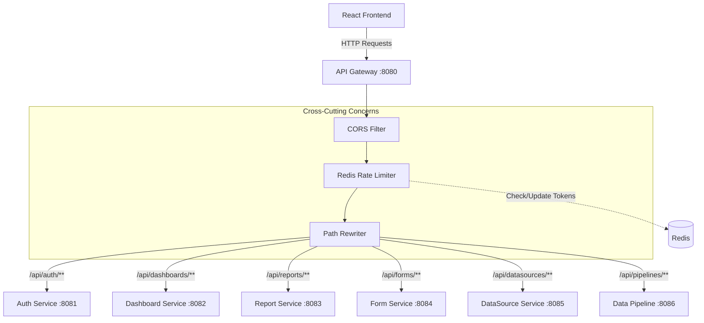

# API Gateway Service

The **API Gateway** serves as the single entry point for all client requests entering the ReportForge ecosystem. Built with Spring Cloud Gateway, it routes traffic to the appropriate downstream microservices, handles cross-cutting concerns like CORS and Rate Limiting, and hides the internal microservice architecture from the frontend.

## 🏗️ Architecture & Flow



## ⚙️ Design Considerations

### 1. Spring Cloud Gateway vs. Zuul
We opted for **Spring Cloud Gateway** over Netflix Zuul because it is built on Spring WebFlux (Project Reactor), providing a non-blocking, asynchronous, and highly performant reactive architecture ideal for handling thousands of concurrent connections.

### 2. Rate Limiting Strategy
To protect backend services from abuse or DDoS attacks, we implemented the **Token Bucket Algorithm** using Redis (`RequestRateLimiter` filter).
*   **Replenish Rate**: 10 requests per second (how fast tokens are added).
*   **Burst Capacity**: 20 requests (maximum concurrent burst allowed).
*   **Key Resolver**: Currently routes are rate-limited globally (or by IP), ensuring fair usage. If Redis is down, the gateway can be configured to either fail-open or fail-closed.

### 3. Path Routing & Rewriting
The gateway exposes clean paths to the frontend (`/api/auth/**`) and maps them to the underlying service paths (`/**`). For example, a request to `/api/auth/login` is rewritten to `/login` before being forwarded to the Auth Service.
This abstraction allows internal service APIs to change without affecting the frontend.

## 🚦 Application Properties

```yaml
spring:
  cloud:
    gateway:
      globalcors:
        cors-configurations:
          '[/**]':
            allowedOrigins: "*"
            allowedMethods: "*"
            allowedHeaders: "*"
      routes:
        - id: auth-service
          uri: http://auth-service:8081
          predicates:
            - Path=/api/auth/**
          filters:
            - RewritePath=/api/auth/(?<segment>.*), /$\{segment}
            - name: RequestRateLimiter # Redis Rate Limiting
              args:
                redis-rate-limiter.replenishRate: 10
                redis-rate-limiter.burstCapacity: 20
        # ... other routes
```

## 🛠️ Tech Stack
*   **Java 17 / Spring Boot 2.7.x**
*   **Spring Cloud Gateway** (Reactive Routing)
*   **Spring Boot Starter Data Redis Reactive** (Rate Limiting)
*   **Resilience4j** (Optional: Circuit breaking for downstream failures)

## 🚀 Running Locally
```bash
mvn spring-boot:run
# Gateway will be available on http://localhost:8080
```
