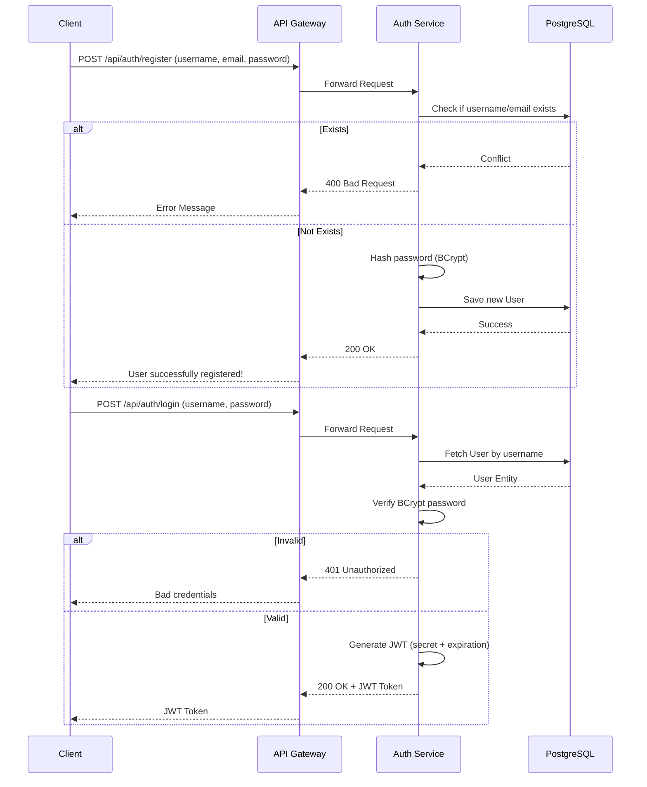
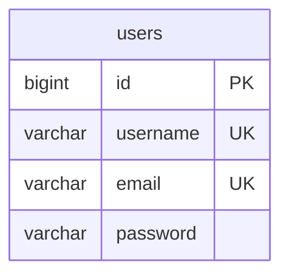

# Auth Service

The **Auth Service** is responsible for user identity management, authentication, and authorization within the ReportForge ecosystem. It provides endpoints for user registration, login, and profile retrieval, utilizing stateless JSON Web Tokens (JWT) to secure subsequent API calls across all microservices.

## 🏗️ Architecture & Flow



## ⚙️ Design Considerations

### 1. Stateless Authentication (JWT)
We chose **Stateless JWT** over stateful session cookies (e.g., Spring Session + Redis) to maintain horizontal scalability and reduce infrastructure cross-dependencies. The JWT contains the user's roles and ID, allowing other services to independently verify the token using the shared signing secret without needing to call the Auth Service or a database.

### 2. Password Security
Passwords are never stored in plaintext. We utilize **BCrypt** hashing with a high cost factor. BCrypt is specifically designed to be slow and computationally expensive, protecting against brute-force and rainbow table attacks.

### 3. Role-Based Access Control (RBAC)
The JWT encodes a list of Granted Authorities (e.g., `ROLE_USER`, `ROLE_ADMIN`). Downstream services (like Dashboard or Report Service) use `@PreAuthorize("hasRole('ADMIN')")` at the method level to enforce fine-grained access policies without tight coupling to the Auth Service.

## 🗄️ Database Schema



## 🛣️ API Endpoints

| Method | Path | Description | Access |
|---|---|---|---|
| `POST` | `/api/auth/login` | Authenticate and retrieve JWT | Public |
| `POST` | `/api/auth/register` | Register new user account | Public |
| `GET` | `/api/auth/users/{id}` | Get user profile by ID | Authenticated |

## 🛠️ Tech Stack
*   **Java 17 / Spring Boot 2.7.x**
*   **Spring Security** (Authentication/Authorization)
*   **io.jsonwebtoken:jjwt** (JWT Creation & Parsing)
*   **Spring Data JPA** (Database interaction)
*   **PostgreSQL 15** (Persistent storage)

## 🚀 Running Locally
```bash
mvn spring-boot:run
# Service will be available on http://localhost:8081
```