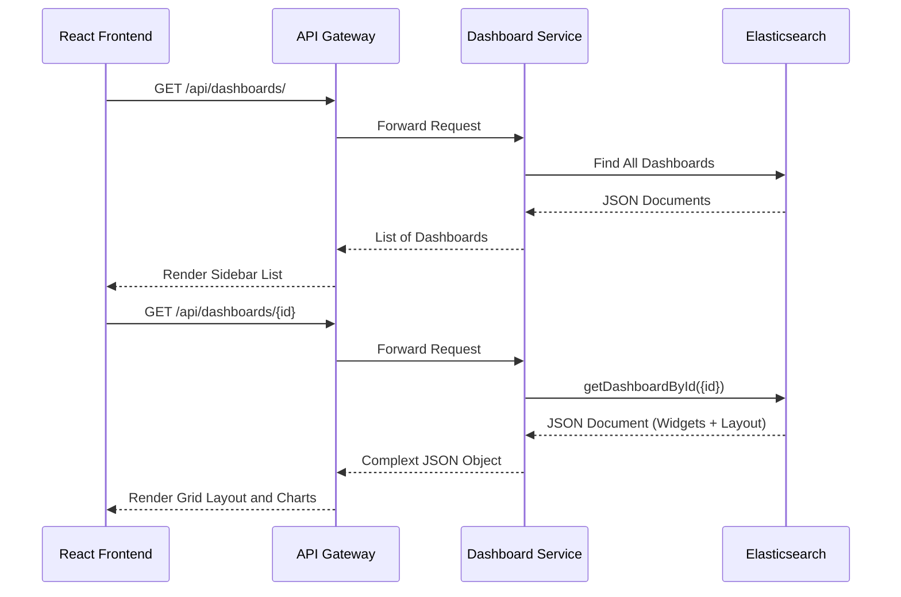

# Dashboard Service

The **Dashboard Service** handles the creation, retrieval, updating, and deletion of business dashboards and their constituent widgets (charts, KPIs, tables). It persists layout configurations and widget definitions in Elasticsearch, allowing the frontend to dynamically render analytic views tailored to the user.

## 🏗️ Architecture & Flow



## ⚙️ Design Considerations

### 1. Elasticsearch vs. Relational Data
We use **Elasticsearch** (via Spring Data Elasticsearch) to store the dashboard data rather than PostgreSQL.
*   **Why Document Store?** A dashboard contains a highly flexible, deeply nested object representing grid layout coordinates (`x`, `y`, `w`, `h`) and heterogeneous widget definitions (some widgets are bar charts, some are KPIs, some are data tables). A NoSQL document store handles this polymorphic, schema-less json perfectly without requiring complex JPA entity mapping and foreign keys.
*   **Performance**: Fetching a single extensive document representing the full dashboard state is significantly faster than executing relational joins across `dashboards`, `widgets`, `widget_properties`, and `layout_positions` tables.

### 2. Widget Independence
The backend does not execute the data queries for the widgets. The Dashboard Service simply stores the configuration (e.g., Widget Type: 'BAR_CHART', Target Report ID: '1234'). The frontend engine reads this config and reaches out to the **Report Service** to fetch the actual data to hydrate the chart. This decouples visualization configuration from data execution logic.

## 🗄️ Document Mapping

```json
{
  "id": "1",
  "name": "Executive Overview",
  "description": "High-level metrics",
  "widgets": [
    {
      "id": "w1",
      "type": "BAR_CHART",
      "title": "Monthly Revenue",
      "reportId": "100"
    }
  ],
  "layout": [
    { "i": "w1", "x": 0, "y": 0, "w": 6, "h": 4 }
  ],
  "owner": "admin",
  "createdAt": "2023-10-24T10:00:00Z"
}
```

## 🛠️ Tech Stack
*   **Java 17 / Spring Boot 2.7.x**
*   **Spring Data Elasticsearch**
*   **Elasticsearch 8.x**

## 🚀 Running Locally
```bash
mvn spring-boot:run
# Service will be available on http://localhost:8082
```