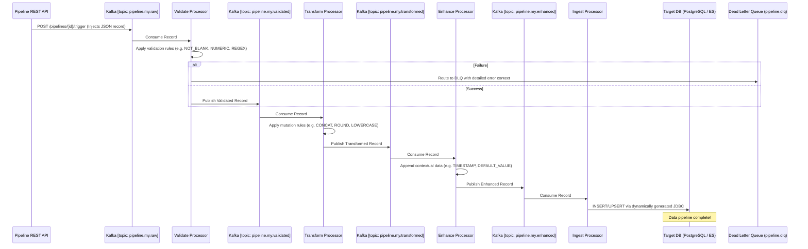

# Data Pipeline Service

The **Data Pipeline Service** is a generic, highly-configurable **Extract, Transform, Enhance, and Load (ETL)** microservice engine entirely driven by YAML files. It requires **zero code changes** to support new enterprise data flows.

It uses Apache Kafka as its backbone for robust inter-phase communication and fault tolerance.

## 🏗️ Architecture & Flow



## ⚙️ Design Considerations

### 1. Configuration as Data
Instead of creating `CustomerPipeline.java` or `SalesETL.java`, the entire pipeline is defined via YAML properties (`application.yml` served via Config Server). At startup, `PostProcessor` classes bind these properties into POJOs (`PipelineProperties`).
The orchestrator dynamically registers Spring Kafka `ConcurrentMessageListenerContainer` factories on-the-fly based on the topics defined in the configuration files.

### 2. Auto-Wired Kafka Initialization
The `KafkaTopicInitializer` class automatically creates the required Kafka topics (and partitions) specified in the configurations. It ensures the environment correctly provisions components before consumers start listening, significantly lowering DevOps friction.

### 3. Fault Isolation & Dead Letter Queues (DLQ)
If a record lacks a necessary field (`type: REQUIRED`), fails regex validation, or throws a `ProcessingException` during transformation, it does not halt the entire pipeline partition or cause an infinite retry loop.
Instead, the `DeadLetterHandler` intercepts the error and routes the failed `PipelineRecord` payload—augmented with the `pipelineId`, `phaseIndex`, and `traceId`—to a designated `pipeline.dlq` topic where administrators or secondary services can remediate data quality issues.

### 4. Modular Strategy Design Pattern
The `PhaseProcessorFactory` auto-discovers beans implementing `PhaseProcessor`. Each implementation (`ValidateProcessor`, `TransformProcessor`) registers via its `@Component("validate")` name. This plug-and-play architecture means adding an `EnrichProcessor` that calls an external REST API simply involves adding a new class without modifying the master orchestrator code.

## 📝 Example Configuration (`application.yml`)

```yaml
pipeline:
  definitions:
    # A complete end-to-end example pipeline
    user-ingest-pipeline:
      description: Ingests raw user logs, validates, cleans names, adds timestamp, and writes to PG.
      phases:
        - name: validate
          topic-in: pipeline.users.raw
          topic-out: pipeline.users.validated
          rules:
            - { field: email, type: NOT_BLANK }
            - { field: age, type: NUMERIC, min: 18 }
        - name: transform
          topic-in: pipeline.users.validated
          topic-out: pipeline.users.transformed
          rules:
            - { field: email, type: LOWERCASE }
            - { field: full_name, type: CONCAT, sources: [first_name, last_name], separator: " " }
        - name: enhance
          topic-in: pipeline.users.transformed
          topic-out: pipeline.users.enhanced
          rules:
            - { field: ingested_at, type: TIMESTAMP }
        - name: ingest
          topic-in: pipeline.users.enhanced
          target:
            type: POSTGRESQL
            table: processed_users
            mode: UPSERT
            key-fields: [email]
```

## 🛠️ Tech Stack
*   **Java 17 / Spring Boot 2.7.x**
*   **Apache Kafka** (Core Backbone/Messaging)
*   **Spring Kafka** (Dynamic Containers/Listeners)
*   **Spring JDBC Template** (Dynamic SQL Engine)
*   **PostgreSQL / Elasticsearch** (Ingestion Targets)

## 🚀 Running Locally
```bash
mvn spring-boot:run
# Service will be available on http://localhost:8086
```
