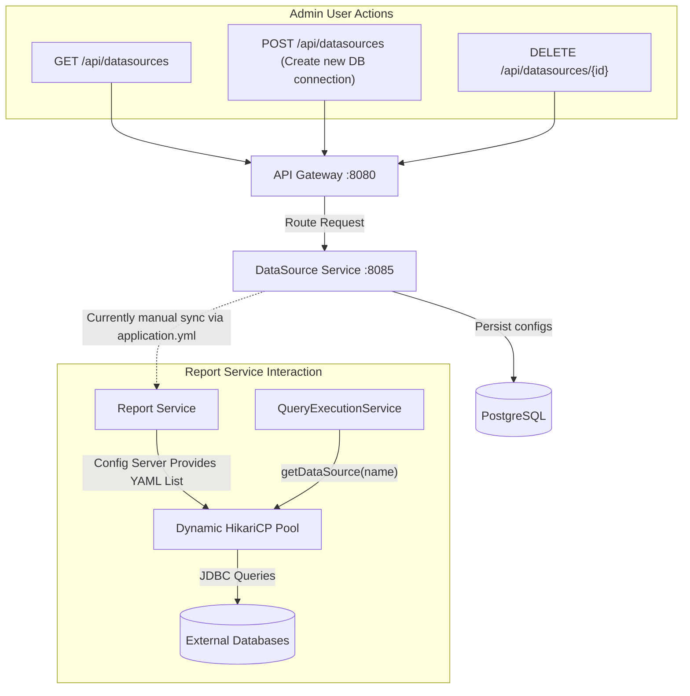
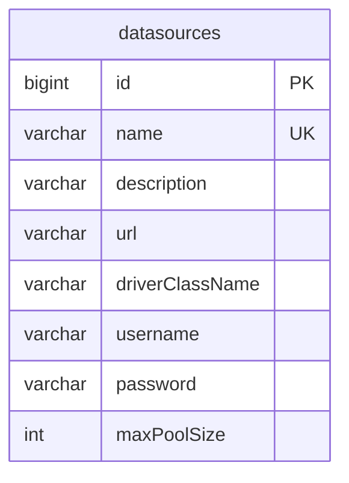

# DataSource Service

The **DataSource Service** manages connection definitions for external databases used by the **Report Service**. It acts as a registry, storing JDBC URLs, credentials, and pool configurations for databases ranging from PostgreSQL and MySQL to Snowflake and ClickHouse.

## 🏗️ Architecture & Flow



## ⚙️ Design Considerations

### 1. Dynamic Routing Architecture
The concept of this service is central to the platform's multi-tenant reporting capability. The application must connect to databases it did not know about at compilation time. The DataSource service stores the credentials in a secure manner.

### 2. Integration with Report Service
Currently, the `Report Service` relies on the `Config Server` (`report-service.yml`) to initialize its `DynamicDataSourceRegistry`. The long-term architectural goal of the `DataSource Service` is to expose an endpoint that the `Report Service` polls or subscribes to (via Kafka), dynamically injecting new `HikariDataSource` objects into the Spring context at runtime whenever an admin adds a new source here.

### 3. Credential Security
*   **Current State**: Passwords are saved directly.
*   **Future State**: Integration with HashiCorp Vault. The DataSource service should only store a Vault reference, while the actual `JDBC Username/Password` is fetched dynamically when connection pools are constructed, guaranteeing secrets are never leaked if the Postgres DB is compromised.

## 🗄️ Database Schema



## 🛠️ Tech Stack
*   **Java 17 / Spring Boot 2.7.x**
*   **Spring Data JPA**
*   **PostgreSQL 15**

## 🚀 Running Locally
```bash
mvn spring-boot:run
# Service will be available on http://localhost:8085
```