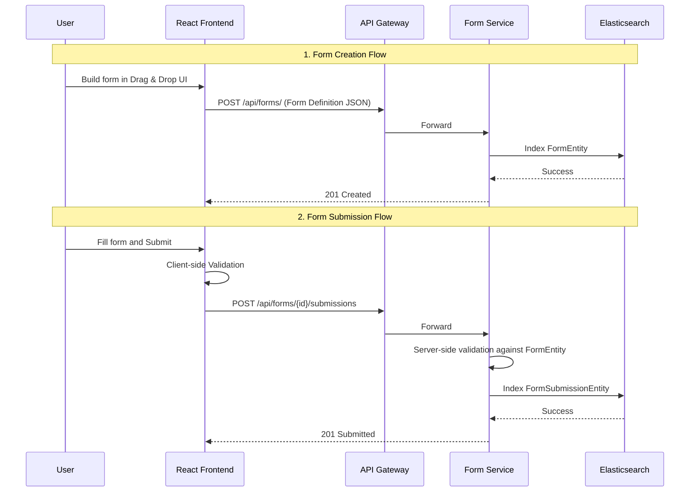

# Form Service

The **Form Service** facilitates dynamic data collection. It manages both the *definitions* (the structure of the forms, fields, validation logic) and the *submissions* (the data users input into those forms). Similar to the Dashboard Service, it heavily leverages Elasticsearch to handle variable document schemas.

## 🏗️ Architecture & Flow



## ⚙️ Design Considerations

### 1. Document-Oriented Storage (Elasticsearch)
If we used PostgreSQL, a dynamic form builder requires the complex **Entity-Attribute-Value (EAV)** anti-pattern. EAV tables become massive and queries become incredibly slow and complicated.
By using **Elasticsearch**, each form definition simply stores an array of flexible JSON objects (representing `TextField`, `DropdownField`, `DateRangeField`). Furthermore, each user *submission* is stored as a flat JSON document (`{"first_name": "John", "age": 30}`), making searching, aggregating, and analyzing submission data blazingly fast using native Lucene indices.

### 2. Validation Subsystem
Forms require robust validation. The Form Service handles parsing constraints like `isRequired`, `minLength`, `maxLength`, and `pattern` (Regex). While the frontend (React Hook Form + Zod) handles client-side alerts, the backend strictly validates the payload before persisting it to Elasticsearch to ensure data integrity.

### 3. Submission Aggregation
Elasticsearch's powerful Aggregation framework allows us to natively query "What is the average age of respondents?" or "Show a bucketed histogram of submission dates"—queries that power the analytics dashboards connected to these forms.

## 🗄️ Document Mapping & Inheritance

The Form Entity leverages polymorphism:
*   A `FormEntity` has a list of `FormField` objects.
*   `FormField` is an interface or abstract class.
*   Implementing classes include `TextFormField`, `SelectFormField`, `DateFormField`, etc., each with unique properties serialized gracefully via Jackson.

## 🛠️ Tech Stack
*   **Java 17 / Spring Boot 2.7.x**
*   **Spring Data Elasticsearch**
*   **Elasticsearch 8.x**

## 🚀 Running Locally
```bash
mvn spring-boot:run
# Service will be available on http://localhost:8084
```