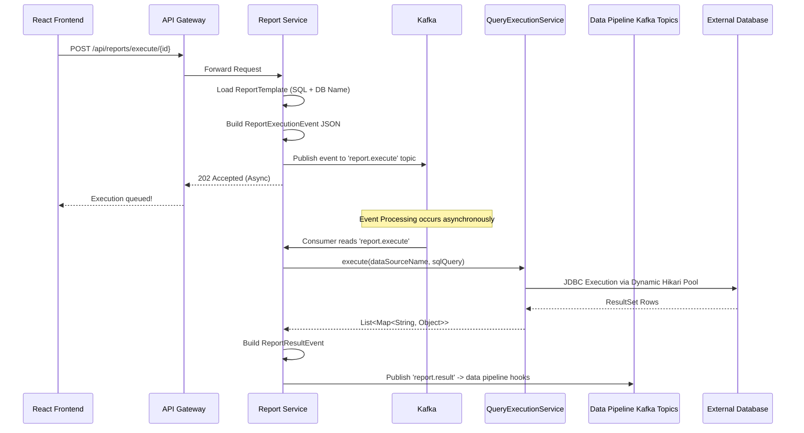
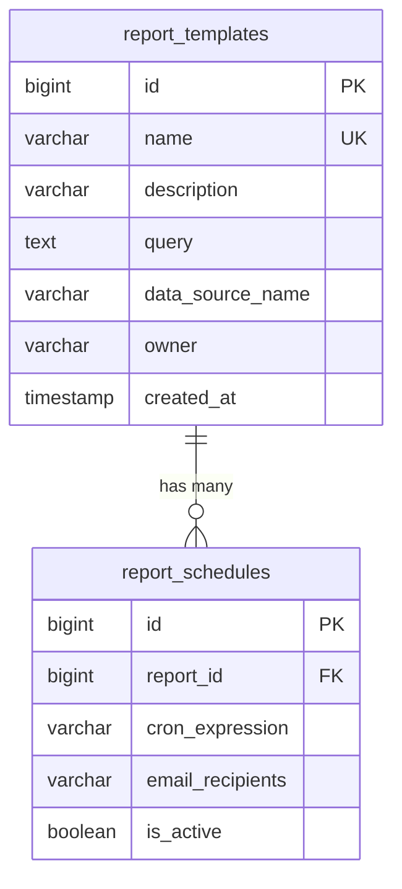

# Report Service

The **Report Service** is the core analytical execution engine of ReportForge. It manages report templates, schedules, and handles the asynchronous execution of complex SQL queries against dynamically registered external databases (via the DataSource service/Config Server) utilizing Apache Kafka for scalable, decoupled processing.

## 🏗️ Architecture & Flow



## ⚙️ Design Considerations

### 1. Extensibility & Dynamic Data Sources
Instead of hardcoding a `DataSource` bean for a single persistent Postgres database, the Report Service leverages a `DynamicDataSourceRegistry`. Using `HikariDataSource` pools defined in `report-service.yml` from the Config Server, the service maps a `dataSourceName` string saved on the `ReportTemplateEntity` to a liveJDBC connection at runtime.

### 2. High Concurrency via Apache Kafka
Report/Analytics queries are historically slow and resource-intensive (`SELECT * FROM massive_table JOIN ...`).
*   **Synchronous Flow (Anti-pattern)**: A user clicks `Execute`. The API thread blocks for 45 seconds while the database grinds. The HTTP connection times out, and threads pile up on Tomcat.
*   **Asynchronous Flow (Current Pattern)**: When a user clicks `Execute`, the Report Service immediately acknowledges the request (HTTP 202) and publishes a `ReportExecutionEvent` to the **Kafka message broker**. Consumer threads process the queries in the background and publish the results stream back to Kafka (or to the user via WebSockets in future iterations). This guarantees UI responsiveness and system stability under load.

### 3. Future Enhancements: Object Storage for Results
Currently, the results flow over Kafka channels. In the future architecture, massive multi-gigabyte query result sets should be written directly to a cloud Object Storage (AWS S3) and a signed download URL generated for the end-user rather than flooding the messaging backbone.

## 🗄️ Database Schema



## 🛠️ Tech Stack
*   **Java 17 / Spring Boot 2.7.x**
*   **Apache Kafka** (Event-Driven Architecture)
*   **Spring Data JPA** (PostgreSQL 15)
*   **HikariCP** (Connection Pooling)
*   **Cron/Quartz** (Scheduled Reports)

## 🚀 Running Locally
```bash
mvn spring-boot:run
# Service will be available on http://localhost:8083
```